# CI/CD Workflow Generation Process Flow Diagram

## Mermaid Flowchart

```mermaid
flowchart TD
    Start([User Requests CI/CD Workflow Generation]) --> CheckRegen{"Regeneration Request?"}

    CheckRegen -->|Yes| Cleanup["Delete Existing Artifacts"]
    CheckRegen -->|No| Welcome["Display Welcome Message"]

    Cleanup --> Welcome

    Welcome --> CheckSession{"Existing Session?"}

    CheckSession -->|Yes| Resume["Resume from Previous Phase"]
    CheckSession -->|No| Init["Initialize New Session"]

    Resume --> ConfirmStart{"Ready to Begin?"}
    Init --> ConfirmStart

    ConfirmStart -->|No| WaitStart[Wait]
    WaitStart --> ConfirmStart
    ConfirmStart -->|Yes| Phase1["Phase 1: Detect & Plan"]

    Phase1 --> Actions1["Scan Code, Analyze Dependencies, Create Plan"]
    Actions1 --> Confirm1{"Ready to Generate Workflows?"}
    Confirm1 -->|No| Wait1[Wait]
    Wait1 --> Confirm1
    Confirm1 -->|Yes| Phase2["Phase 2: Generate Workflows"]

    Phase2 --> Actions2["Generate Orchestrator & Code Type Workflows"]
    Actions2 --> Confirm2{"Ready to Review & Confirm?"}
    Confirm2 -->|No| Wait2[Wait]
    Wait2 --> Confirm2
    Confirm2 -->|Yes| Phase3["Phase 3: Review & Confirm"]

    Phase3 --> Actions3["Review Workflows, Validate Syntax, Present Details"]
    Actions3 --> Confirm3{"Approve Final Workflows?"}
    Confirm3 -->|No| Wait3[Wait]
    Wait3 --> Confirm3
    Confirm3 -->|Yes| Phase4["Phase 4: Commit & Push"]

    Phase4 --> Actions4["Commit & Push Workflow Files"]
    Actions4 --> End([Complete])

    style Start fill:#e1f5ff
    style End fill:#d4edda
    style Phase1 fill:#fff3cd
    style Phase2 fill:#fff3cd
    style Phase3 fill:#fff3cd
    style Phase4 fill:#fff3cd
    style CheckRegen fill:#f8d7da
    style CheckSession fill:#f8d7da
    style ConfirmStart fill:#d1ecf1
    style Confirm1 fill:#d1ecf1
    style Confirm2 fill:#d1ecf1
    style Confirm3 fill:#d1ecf1
    style Actions1 fill:#f0f0f0
    style Actions2 fill:#f0f0f0
    style Actions3 fill:#f0f0f0
    style Actions4 fill:#f0f0f0
```

## High-Level Process Flow

### Entry & Initialization
1. **User Request** → Check for regeneration request
2. **Welcome & Session Check** → Display welcome message and check for existing session
3. **Initial Confirmation** → User confirms ready to begin

### Phase 1: Detect & Plan
- **Actions**: Scan repository, detect code types, analyze dependencies, create plan
- **Checkpoint**: User confirms ready to generate workflows

### Phase 2: Generate Workflows
- **Actions**: Generate orchestrator and code type workflows (dev/test/prd)
- **Checkpoint**: User confirms ready to review

### Phase 3: Review & Confirm
- **Actions**: Review workflows, validate syntax, present details
- **Checkpoint**: User approves final workflows

### Phase 4: Commit & Push
- **Actions**: Commit and push workflow files to repository
- **Completion**: Workflow generation complete

