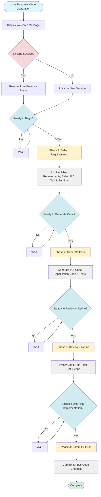

# Code Generation Workflow Process Flow Diagram

## Mermaid Flowchart

## High-Level Process Flow

### Entry & Initialization
1. **User Request** → User requests code generation from JIRA requirements
2. **Welcome & Session Check** → Display welcome message and check for existing session
3. **Initial Confirmation** → User confirms ready to begin

### Phase 1: Select Requirements
- **Actions**: List available requirements documents, select requirements, choose IAC tool and runtime
- **Checkpoint**: User confirms ready to generate code

### Phase 2: Generate Code
- **Actions**: Generate Infrastructure as Code, application code, and tests
- **Checkpoint**: User confirms ready to review and refine

### Phase 3: Review & Refine
- **Actions**: Review code, run tests, perform linting, refine implementation
- **Checkpoint**: User approves final implementation

### Phase 4: Commit & Push
- **Actions**: Commit and push code changes to repository (optional)
- **Completion**: Code generation complete

