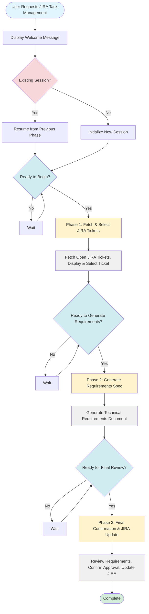

# JIRA Task Management Workflow Process Flow Diagram

## Mermaid Flowchart

## High-Level Process Flow

### Entry & Initialization
1. **User Request** → User requests JIRA task management
2. **Welcome & Session Check** → Display welcome message and check for existing session
3. **Initial Confirmation** → User confirms ready to begin

### Phase 1: Fetch & Select JIRA Tickets
- **Actions**: Fetch open JIRA tickets, display list, allow user to select ticket
- **Checkpoint**: User confirms ready to generate requirements

### Phase 2: Generate Requirements Spec
- **Actions**: Generate comprehensive technical requirements document based on JIRA ticket
- **Checkpoint**: User confirms ready for final review

### Phase 3: Final Confirmation & JIRA Update
- **Actions**: Review requirements, confirm approval, update JIRA ticket
- **Completion**: Requirements generation and JIRA update complete

