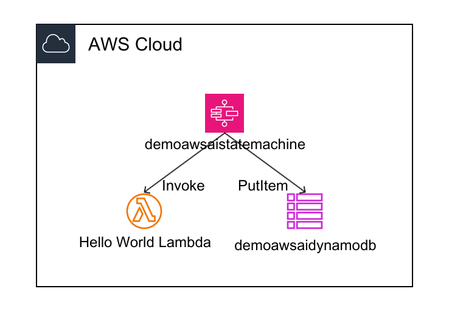

# Technical Requirements Specification

## Document Information

- **Ticket Number**: AWS-10
- **Ticket Title**: Demo step function application
- **Created Date**: 2025-11-09
- **Last Updated**: 2025-11-10
- **Status**: To Do

## 1. Project Overview

**Business Objective**: Create a demonstration Step Functions state machine that orchestrates a simple workflow involving a Lambda function and DynamoDB table to showcase AWS service integration capabilities.

**Solution Summary**: Implement a Step Functions state machine that receives JSON input, triggers a hello world Lambda function, and inserts a record into a DynamoDB table with timestamp and message from the input payload.

**Scope**:

- **In Scope**: Step Functions state machine, Lambda function, DynamoDB table, IAM roles and permissions for service integration
- **Out of Scope**: Production-grade error handling, complex business logic, multi-region deployment, advanced monitoring and alerting

## 2. Functional Requirements

### 2.1 Core Functionality

- **FR-1**: Step Functions state machine must receive JSON input with the following format:

  ```json
  {
    "message": "Hello step function"
  }
  ```

- **FR-2**: Step Functions state machine must trigger a hello world Lambda function as part of the workflow execution. The Lambda function should simply return a "hello world" message (no processing of input message required). The Lambda execution is fire-and-forget (no return data needed by Step Functions).

- **FR-3**: Step Functions state machine must insert a record into a DynamoDB table with the following structure:

  - **Partition Key**: Generated ID (unique identifier for each record)
  - **Timestamp**: Current timestamp (generated at time of insertion)
  - **Message**: Value from the input JSON payload (`message` field)

- **FR-4**: The workflow execution can run Lambda invocation and DynamoDB insertion in parallel (both operations can execute simultaneously after receiving input).

### 2.2 User Interactions

- **UI-1**: Step Functions state machine can be triggered via AWS Console, AWS CLI, or API call with JSON input payload.

- **API-1**: Step Functions execution API accepts JSON input and returns execution ARN and status.

### 2.3 Data Requirements

**Data Input**:

- JSON payload with `message` field (string)
- Example: `{"message": "Hello step function"}`

**Data Processing**:

- Step Functions orchestrates workflow execution
- Lambda function receives input and processes it (hello world functionality)
- DynamoDB record is created with timestamp and message

**Data Output**:

- DynamoDB record with:
  - Timestamp (current timestamp at insertion time)
  - Message (from input JSON payload)
- Step Functions execution result (success/failure status)

**Data Volume**: Demo-level data volumes (low volume, single record per execution)

## 3. Non-Functional Requirements

### 3.1 Performance

- **Response Time**: Not specified (demo application)
- **Throughput**: Not specified (demo application)
- **Scalability**: Not specified (demo application)

### 3.2 Security

- **Authentication**: AWS IAM-based authentication for service access
- **Authorization**: IAM roles with least privilege permissions for Step Functions, Lambda, and DynamoDB
- **Data Protection**: Standard AWS encryption at rest and in transit
- **Audit**: CloudTrail logging for API calls (default AWS behavior)

### 3.3 Reliability

- **Availability**: Standard AWS service availability (no specific SLA requirement for demo)
- **Disaster Recovery**: Not applicable for demo application
- **Backup**: Not required for demo application

### 3.4 Operational

- **Monitoring**: CloudWatch logs for Lambda function execution
- **Logging**: Step Functions execution history, Lambda CloudWatch logs, DynamoDB operations
- **Alerting**: Not required for demo application

## 4. Technical Specifications

### 4.1 Architecture

**Architecture Approach**: Serverless architecture using AWS Step Functions to orchestrate Lambda and DynamoDB operations.

**Architecture Diagram**: Visual representation of the AWS architecture:



**Figure 1: AWS Architecture Diagram**

**Technology Stack**:

- **Infrastructure as Code**: Terraform (based on existing project structure)
- **Programming Language**: Python (for Lambda function, based on existing project structure)
- **Orchestration**: AWS Step Functions
- **Compute**: AWS Lambda
- **Database**: AWS DynamoDB

### 4.2 AWS Services

- **Compute**: AWS Lambda (hello world function - returns "hello world" message, fire-and-forget execution)
- **Orchestration**: AWS Step Functions (state machine - supports parallel execution of Lambda and DynamoDB operations)
- **Storage**: AWS DynamoDB (demo table with generated ID as partition key)
- **Security**: AWS IAM (roles and permissions - standard Step Functions, Lambda, and DynamoDB permissions only)
- **Monitoring**: AWS CloudWatch (logs and metrics)

### 4.3 Integration Points

**External Systems**: None (standalone demo application)

**API Contracts**:

- Step Functions execution API accepts JSON input: `{"message": "string"}`
- Lambda function receives event from Step Functions
- DynamoDB PutItem operation with timestamp and message

**Data Formats**:

- Input: JSON format with `message` field
- Output: DynamoDB record with `timestamp` and `message` fields

### 4.4 Environment Requirements

- **Environments**: Demo environment
- **AWS Region**: us-east-1
- **Deployment**: Infrastructure as Code (Terraform) deployment

## 5. Acceptance Criteria

### 5.1 Functional Acceptance

- [ ] Step Functions state machine is created and can be executed
- [ ] Step Functions state machine accepts JSON input with `message` field
- [ ] Lambda function is triggered successfully by Step Functions
- [ ] DynamoDB record is inserted with correct timestamp (current time) and message (from input)
- [ ] All components are properly integrated and functional
- [ ] Workflow executes in correct sequence: input → Lambda → DynamoDB

### 5.2 Non-Functional Acceptance

- [ ] IAM roles and permissions are configured with least privilege
- [ ] CloudWatch logs are available for Lambda function execution
- [ ] Step Functions execution history is accessible
- [ ] Infrastructure is deployed using Terraform
- [ ] Code follows existing project structure and standards

## 6. Dependencies

### 6.1 Technical Dependencies

- **Other JIRA Tickets**: None identified
- **External Services**: None
- **Infrastructure**: AWS account with appropriate permissions for Step Functions, Lambda, and DynamoDB

### 6.2 Team Dependencies

- **Other Teams**: None
- **Coordination**: None

## 7. Assumptions

> **IMPORTANT**: This section should be **EMPTY** during initial requirements generation. No assumptions should be made. If information is missing or ambiguous, add it as a question in the "Open Questions" section using `[Answer]:` tags.

- _No assumptions - all information should be clarified through Open Questions section_

## 8. Risks

- **RISK-1**: Lambda function execution failure

  - **Impact**: Medium
  - **Mitigation**: If Lambda function fails, Step Functions workflow will not retry (as per requirements). Configure CloudWatch logs for debugging. Workflow will continue to DynamoDB insertion even if Lambda fails (fire-and-forget behavior).

- **RISK-2**: DynamoDB write failure

  - **Impact**: High
  - **Mitigation**: If DynamoDB insert fails, Step Functions workflow will fail the execution (as per requirements). Verify IAM permissions and table configuration before deployment.

- **RISK-3**: IAM permission misconfiguration
  - **Impact**: High
  - **Mitigation**: Follow least privilege principle, test permissions during deployment

## 9. Resolved Questions

All questions have been answered and incorporated into the requirements document above. The following clarifications were provided:

1. **Lambda Function Behavior**: Lambda function should just return "hello world" message (no processing of input message required).

2. **Lambda Return Data**: Lambda execution is fire-and-forget (no return data needed by Step Functions).

3. **DynamoDB Table Name**: Any naming convention is acceptable.

4. **DynamoDB Partition Key**: Generated ID will be used as the partition key (primary key).

5. **Workflow Execution**: Lambda invocation and DynamoDB insertion can run in parallel.

6. **AWS Region**: Resources will be deployed to us-east-1.

7. **Environment**: Demo environment.

8. **Lambda Failure Handling**: If Lambda function fails, no retry will be attempted (workflow continues to DynamoDB insertion due to fire-and-forget behavior).

9. **DynamoDB Failure Handling**: If DynamoDB insert fails, Step Functions workflow will fail the execution.

10. **IAM Permissions**: Standard Step Functions, Lambda, and DynamoDB permissions only (no additional requirements).
